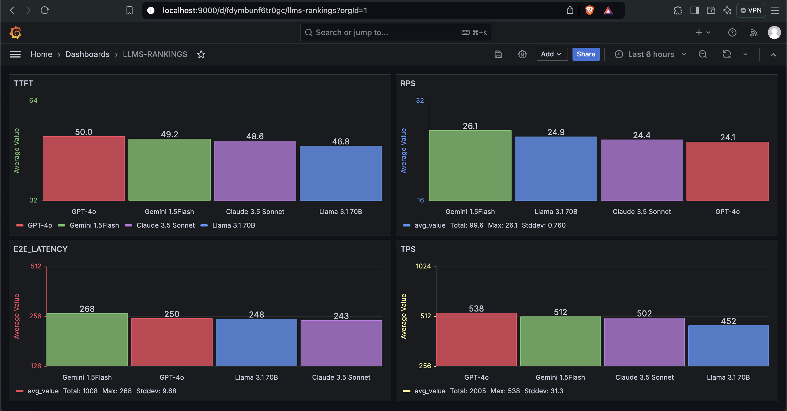

LLMs Metrics Ranking:

Go-lang programming language was employed in the design and implementation of the solution to simulate and generate data for LLM performance metrics.

Project Structure
.
├── cmd
│   └── api 
        └── main.go          # Entry point
    └── sim
        └── main.go          # Random Metrics Simulations
├── api
│   └── metrics.go       # API endpoints for LLM metric ranking
├── models
│   └── llm_metrics.go   # Database models
├── randomizer
│   └── simulate.go      # LLM metric simulation and randomizer
├── storage
│   └── db.go            # Database connection and queries
├── config
│   └── config.go        # Configuration management (API keys, DB settings)
├── utils
│   └── retry.go         # Retry logic or queue handling for failures
└── go.mod

1. Metric Simulator

Database Model for LLM Simulation Results.

Three tables are initially seeded into the database when application starts, these tables are labelled; 
llms  (for storing list of llms)
metrics (for storing the 4 different metrics)
llms_metrics (for storing the generated values of metrics against the respective llms )

A database schema, designed to store LLM performance data for each metric is as seen below together with a  simplified model using Go's struct that maps to a relational database (PostgreSQL).

A table called llm_metrics would have columns for LLM names, metric types, and their corresponding simulated values. Below is a corresponding table creation statement in SQL (Postgres)

CREATE TABLE llm_metrics (
    id SERIAL PRIMARY KEY,
    llm_name VARCHAR(255),
    metric_type VARCHAR(50),
    value FLOAT,
    created_at TIMESTAMP DEFAULT CURRENT_TIMESTAMP
);

package models type LLMMetric struct { ID int `json:"id"` LLMName string `json:"llm_name"` MetricType string `json:"metric_type"` Value float64 `json:"value"` CreatedAt time.Time `json:"created_at"` }

Randomizer for Data Simulation
A randomizer will generate 1,000 random data points for each LLM across different metrics.

// ParallelSimulation runs simulations for multiple LLMs concurrently
func ParallelSimulation() error {
    var wg sync.WaitGroup
    llmChannel := make(chan []models.LLMMetric)

    // Worker to batch insert metrics into the database
    go func() {
        for batch := range llmChannel {
            if err := RetryableStoreMetric(batch, config.AppConfig.MaxRetries, time.Duration(config.AppConfig.RetryDelayMs)); err != nil {
                // Handle error: retry logic or log failure
                log.Println("Error storing batch: ", err)
            }
        }
    }()

    var (
        metricsy []string
        llmsy    []string
    )
    //var metricsy []string
    metricsy, err := cache.GetMetrics()
    if err != nil {
        return err
    }

    //var llmsy []string
    llmsy, err = cache.GetLLMS()
    if err != nil {
        return err
    }

    for _, llm := range llmsy {
        for _, metric := range metricsy {
            wg.Add(1)
            go func(llm, metric string) {
                defer wg.Done()
                simulatedMetrics := SimulateLLM(llm, metric, numDataPoints)
                llmChannel <- simulatedMetrics
            }(llm, metric)
        }
    }

    // Wait for all simulations to complete
    wg.Wait()

    // Close the channel when all simulations are done
    close(llmChannel)
    return nil
}

Utilising Go-lang’s concurrency feature, the above code block runs simulations for multiple LLMs concurrently to generates a random value for each LLM-metric combination and stores the result in the database. The key benefits here are parallel execution and non-blocking operation

Below is the  code snippet for random value generation. To make the randomisation efficient, I pre-allocated the size of the slices to avoid repeated memory allocations and also globalised my Seeding value  for reproducibility.

func generateRandomValue(metricType string) float64 {
    rand.New(rand.NewSource(config.AppConfig.Seed)) // Seed globally set once for efficiency
    switch metricType {
    case "TTFT":
        return rand.Float64() * 100 // Simulate Time to First Token in ms
    case "TPS":
        return rand.Float64() * 1000 // Simulate Tokens Per Second
    case "e2e_latency":
        return rand.Float64() * 500 // Simulate end-to-end latency in ms
    case "RPS":
        return rand.Float64() * 50 // Simulate Requests Per Second
    default:
        return rand.Float64() * 1000
    }
}

The generated random values are batch inserted into the database to reduces the number of database round trips and improves throughput.

// Batch Store Metrics inserts multiple metrics into the database in a single query.
func BatchStoreMetrics(metrics []models.LLMMetric, batchSize int) error {
    if len(metrics) == 0 {
        return nil
    }

    valueStrings := make([]string, 0, batchSize)
    valueArgs := make([]interface{}, 0, batchSize*4)
    for i, metric := range metrics {
        valueStrings = append(valueStrings, fmt.Sprintf("($%d, $%d, $%d, $%d)", i*4+1, i*4+2, i*4+3, i*4+4))
        valueArgs = append(valueArgs, metric.LLMName, metric.MetricType, metric.Value, metric.CreatedAt)
    }

    query := fmt.Sprintf("INSERT INTO llm_metrics (llm_name, metric_type, value, created_at) VALUES %s", strings.Join(valueStrings, ","))
    _, err := db.Exec(query, valueArgs...)
    return err
}

// Store llms Metrics
func StoreMetrics(metrics []models.LLMMetric) error {
    batchSize := 100 // Define batch size
    for i := 0; i < len(metrics); i += batchSize {
        end := i + batchSize
        if end > len(metrics) {
            end = len(metrics)
        }
        batch := metrics[i:end]
        if err := BatchStoreMetrics(batch, batchSize); err != nil {
            return err
        }
    }
    return nil
}

 

A code-level retry mechanism is also in place in case of failures, particularly for the database operations to introduce some form of fault tolerance.

// RetryableStoreMetric tries to store the metric in the database with retry logic.
func RetryableStoreMetric(batch []models.LLMMetric, maxRetries int, delay time.Duration) error {
    operation := func() error {
        // Attempt to store the metric
        storage.StoreMetrics(batch)
        return nil
    }

    // Use RetryOperation with maxRetries and delay
    err := utils.RetryOperation(operation, maxRetries, delay)
    if err != nil {
        log.Printf("Failed to store metric after retries: %v", err)
        return err
    }
    return nil
}

2. Metric Benchmarking

Fetch and Rank LLMs by Metric

This function fetches and ranks LLMs based on their mean values for a given metric.

// GetLLMRanking fetches and ranks LLMs by their mean metric values
func GetLLMRanking(metricType string) ([]LLMRank, error) {
    rows, err := db.Query(
        "SELECT llm_name, AVG(value) as avg_value FROM llm_metrics WHERE metric_type = $1 GROUP BY llm_name ORDER BY avg_value DESC",
        metricType,
    )
    if err != nil {
        return nil, err
    }
    defer rows.Close()

    var rankings []LLMRank
    for rows.Next() {
        var rank LLMRank
        if err := rows.Scan(&rank.LLMName, &rank.AvgValue); err != nil {
            return nil, err
        }
        rankings = append(rankings, rank)
    }
    return rankings, nil
}

API Endpoint
The rankings are expose to a RESTful API endpoint using the native net/http package. This endpoint is secured with an API key which is verified via the request header using a middleware

 llms metric ranking will be accessible on the below URI : /ranking/{metric}

E.g
http://localhost:8080/ranking/TTFT

Where metric can be any of the following : "TTFT", "TPS", "e2e_latency", "RPS",

The default configured API  Header Key is :  "X-API-KEY: GPA-prince-edusei-2024"

Find below, Middleware Code-Block:

package api

import (
    "net/http"
)

func ValidateAPIKey(next http.Handler) http.Handler {
    return http.HandlerFunc(func(w http.ResponseWriter, r *http.Request) {
        apiKey := r.Header.Get("X-API-KEY")
        if apiKey != "your-secret-key" {
            http.Error(w, "Unauthorized", http.StatusUnauthorized)
            return
        }
        next.ServeHTTP(w, r)
    })
}

The config.go file handles configuration management for the application. This includes database connection settings, API keys for securing your API, seeding values for reproducibility, and any other configuration parameters your application needs. 

4. Efficient Database Connection Pooling

To optimize database interactions, I used connection pooling. In Go, most database drivers (like pgx for PostgreSQL) support connection pooling out of the box. I configured the maximum number of open connections to avoid overhead from constantly opening and closing connections.

// Set max number of open connections
    db.SetMaxOpenConns(25)

    // Set max idle connections
    db.SetMaxIdleConns(25)

    // Set max connection lifetime
    db.SetConnMaxLifetime(5 * time.Minute)

5. Caching for Read Performance

I used Redis to reduce database load for frequent queries and also Improves read latency by returning cached results.

6. Logging

I integrated Prometheus monitoring into my LLMs application using the Prometheus Client Library. The essence of which is to create metrics to track the application's performance.

Logging endpoint is exposed on the URI  [ /metrics ] without authorisation 

7. Dashboarding

I integrated the generated llms metric data into Grafana and rendered some dashboards to highlight the bar graph representation of three llms for each metric. And these dashboards are highly configurable to allow more llms comparison

 
**Deployment**

I split my application into two micro-services, One for the Random Metric Simulations for the llms and another for the API that will serve the request  

I then dockerized the two  application micro-services and created a helm chart for Kubernetes deployment:

Dockerfile_API
Dockerfile_SIM

**Running the Microservice**

To run the microservice using Docker:

docker build -t llm-api-service:1.0  -f Dockerfile_API .

docker run --env-file .env -p 8080:8080 llm-metrics-api

docker build -t llm-simulation-service:1.0  -f Dockerfile_SIM .

docker run --env-file .env -p 8081:8081 llm-metrics-sim

Helm Chart Directory Structure

llm-metrics-chart/
│
├── Chart.yaml
├── values.yaml
├── templates/
│   ├── simulation-deployment.yaml
│   ├── api-deployment.yaml
│   ├── simulation-service.yaml
│   ├── api-service.yaml
│   ├── configmap.yaml
│   ├── secrets.yaml
│   ├── postgres.yaml
│   ├── redis.yaml
│   ├── prometheus.yaml
│   ├── grafana.yaml
│   ├── _helpers.tpl
│   └── ingress.yaml
└── charts/

**Install the Helm Chart**

Package the chart

helm package llm-metrics-ranking-chart

Install the chart:

helm install llm-metrics-ranking ./llm-metrics-ranking-chart

This will deploy your LLM metrics microservice along with PostgreSQL, Redis, Prometheus, and Grafana.

Verify the pods:

kubectl get pods

**Access Grafana:**

Grafana will be available on port 3000 (default password: admin). 

You can configure it to pull metrics from Prometheus for dashboard visualizations.
